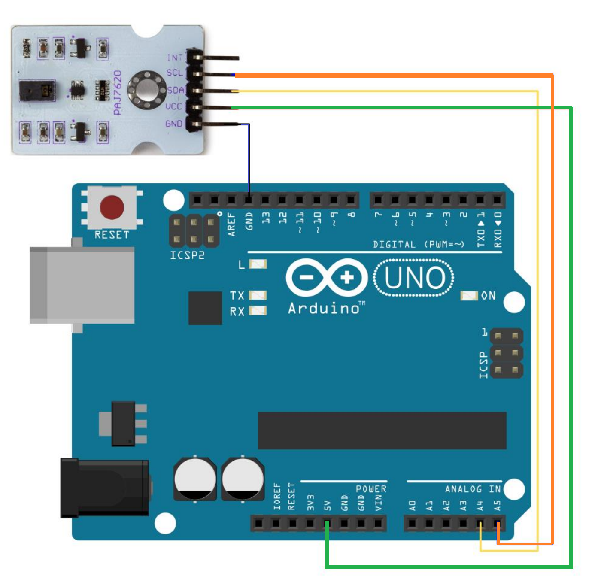
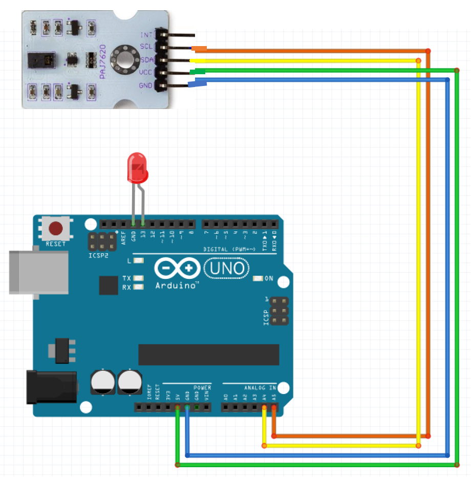

# WPSE358 Gesture recognition sensor module

## Example 1
This example shows how you can use the Whadda WPSE358 gesture recognition sensor module with an Arduino® compatible board.
The example program prints out the hand gesture you're currently making.

### Library dependencies
* RevEng_PAJ7620

### Wiring diagram

## Example 2
This example shows how you can use the Whadda WPSE358 gesture recognition sensor module with an Arduino® compatible board.
The example program turns on an led if you made the right hand gestures one after the other.

### Library dependencies
* RevEng_PAJ7620

### Wiring diagram

## Example 3
This example shows how you can use the Whadda WPSE358 gesture recognition sensor module with an Arduino® compatible board.
The example program presses the left and right arrow keys when you make certain hand gestures.
**Important!!! This example is really difficult because you need to flash the Arduino Uno with specific firmware.**
You can download the firmware in the folder __Firmware To Flash__. See https://docs.arduino.cc/hacking/software/DFUProgramming8U2 about how to flash firmware to your Arduino.
### Library dependencies
* RevEng_PAJ7620

### Wiring diagram

## Additional information
  For more information about the Whadda WPSE358 gesture recognition sensor module, check the manual available at [whadda.com](https://whadda.com)

